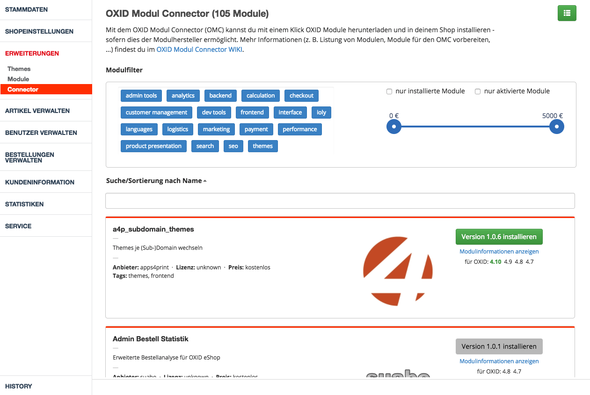

# OXID Modul Connector (de)

Der OXID Modul Connector (OMC) ist ein Modulkatalog für verfügbare OXID Module. Man hat direkt aus dem Shop-Admin die Möglichkeit Module zu installieren, sofern vom Modulanbieter unterstützt. Sollte dies nicht möglich sein ist ein Link zur Modulseite des Anbieters vorhanden.  ([english version](https://github.com/OXIDprojects/OXID-Module-Connector/blob/recipes/README.md))

## Installation

1. [OXID Modul Connector herunterladen](https://github.com/OXIDprojects/OXID-Module-Connector/archive/recipes.zip)
2. Modul (oxcom-omc) ist das /modules Verzeichnis kopieren
3. Modul aktivieren
4. That´s it!

Installation mit Composer oder per Konsole? Kein Problem! ;-) [Mehr lesen](https://github.com/OXIDprojects/OXID-Module-Connector/wiki/Installation)

## Nutzung

- In der Shop-Admin-Navigation im Bereich Erweiterungen gibt es einen neuen Punkt Connector.
- Beim ersten Öffnen des Connectors werden automatisch alle benötigen Daten (ioly Core, aktueller Modulkatalog) heruntergeladen.
- Sobald die Modulliste angezeigt wird kann mit nur einem Klick ein Modul installiert/aktiviert werden.
- Sollte ein Modul nicht als Download zur Verfügung stehen gibt es einen direkten Link zur Modulseite des Anbieters.

## Allgemeine Hinweise

Der OXID Modul Connector basiert auf [ioly](https://github.com/ioly/) und ist während des OXID Hackathons ([#oxhackathon16](https://openspacer.org/12-oxid-community/136-oxid-hackathon-nuernberg-2016/)) entstanden. Das OXIDforge Team kümmert sicg so gut wie möglich um die Aktualität der Module. Jeder der möchte ist natürlich gerne eingeladen auch am Modulkatalog mitzuarbeiten. Der OXID Modul Connector ist ein Community Projekt welches keine Gewährleistung und Anspruch auf Vollständigkeit und Richtigkeit des Inhalts übernimmt.

>**ACHTUNG!**
Der OXID Modul Connector wurde primär für Entwicklungs- und Testumgebungen entwickelt. Vor der Nutzung unbedingt ein Backup (Dateien + Datenbank) anfertigen bevor das erste Modul installiert wird.

## Module einreichen

1. Modulrezept schreiben
2. Rezept auf Github committen
3. Pull-Request senden
4. Fertig, jeder kann das Modul nutzen!

[Mehr lesen](https://github.com/OXIDprojects/OXID-Module-Connector/wiki/Contributing)

## Anforderungen

- PHP 5.4.0 oder höher
- PHP extensions:
  * cUrl
  * JSON
  * ZIP
  
---

## License
Der OXID Modul Connector ist unter der MIT Lizenz lizensiert - für mehr Informationen siehe [Lizenz-Datei](https://github.com/OXIDprojects/OXID-Module-Connector/blob/recipes/LICENSE).
