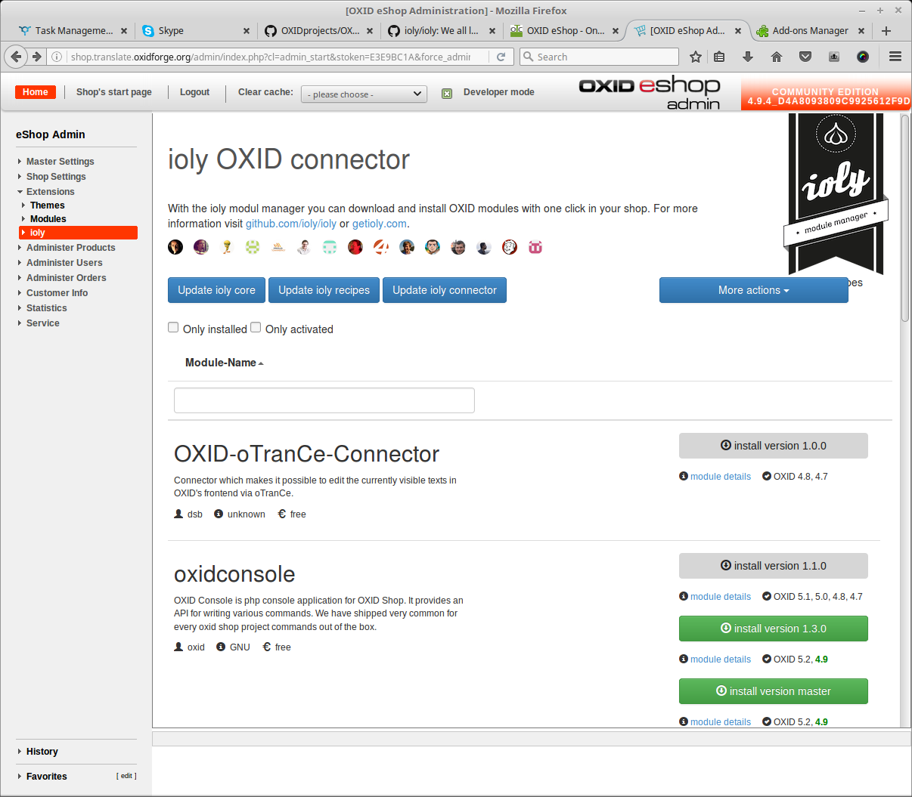

# OXID Module Connector (de)

Der OXID Modul Connector (OMC) ist ein Modulkatalog für verfügbare OXID Module. Man hat direkt aus dem Shop-Admin die Möglichkeit Module zu installieren, sofern vom Modulanbieter unterstützt. Sollte dies nicht möglich sein ist ein Link zur Modulseite des Anbieters vorhanden.

## Installation

1. [OXID Modul Connector herunterladen](https://github.com/OXIDprojects/OXID-Module-Connector/archive/recipes.zip)
2. Modul (oxcom-omc) ist das /modules Verzeichnis kopieren
3. Modul aktivieren
4. That´s it!

## Nutzung

- In der Shop-Admin-Navigation im Bereich Erweiterungen gibt es einen neuen Punkt Connector.
- Beim ersten Öffnen des Connectors werden automatisch alle benötigen Daten (ioly Core, aktueller Modulkatalog) heruntergeladen.
- Sobald die Modulliste angezeigt wird kann mit nur einem Klick ein Modul installiert/aktiviert werden.
- Sollte ein Modul nicht als Download zur Verfügung stehen gibt es einen direkten Link zur Modulseite des Anbieters.

## Allgemeine Hinweise

Der OXID Modul Connector basiert auf [ioly](https://github.com/ioly/) und ist während des OXID Hackathons ([#oxhackathon16](https://openspacer.org/12-oxid-community/136-oxid-hackathon-nuernberg-2016/)) entstanden. Das OXIDforge Team kümmert sicg so gut wie möglich um die Aktualität der Module. Jeder der möchte ist natürlich gerne eingeladen auch am Modulkatalog mitzuarbeiten. Der OXID Modul Connector ist ein Community Projekt welches keine Gewährleistung und Anspruch auf Vollständigkeit und Richtigkeit des Inhalts übernimmt.

>**ATTENTION!**
Der OXID Modul Connector wurde primär für Entwicklungs- und Testumgebungen entwickelt. Vor der Nutzung unbedingt ein Backup (Dateien + Datenbank) anfertigen bevor das erste Modul installiert wird.

------

# OXID Module Connector (en)

OXID Module Connector (OMC) displays available modules, a short description and allows to install these modules automatically (if possible) and directly from the OXID eShop admin panel. If an automated installation is not possible for some reason, OMC links to the original module page.

## Installation

1. [download OXID Modul Connector](https://github.com/OXIDprojects/OXID-Module-Connector/archive/recipes.zip)
2. Extract module (oxcom-omc) to the /modules directory
3. Activate module
4. That´s it!

## Usage

- In der Shop-Admin-Navigation im Bereich Erweiterungen gibt es einen neuen Punkt Connector.
- Beim ersten Öffnen des Connectors werden automatisch alle benötigen Daten (ioly Core, aktueller Modulkatalog) heruntergeladen.
- Sobald die Modulliste angezeigt wird kann mit nur einem Klick ein Modul installiert/aktiviert werden.
- Sollte ein Modul nicht als Download zur Verfügung stehen gibt es einen direkten Link zur Modulseite des Anbieters.

## Notices

This module is based on [ioly](https://github.com/ioly/) and was developed during the [#oxhackathon16](https://openspacer.org/12-oxid-community/136-oxid-hackathon-nuernberg-2016/) event. The OXIDforge editorial team currently takes care of the content (modules) in their leisure time as best as they can.

Please note that this is a community project that comes with absolutely no warranty nor claim for completeness or correctness of the content. If you like it, we appreciate if you contribute either modules or general improvements.

>**ATTENTION!**
This module is designed for development and testing environments. Please do not install any module in your live shop environment! Please backup your installation (database + files) before installing a module via OXID Module Connector!
